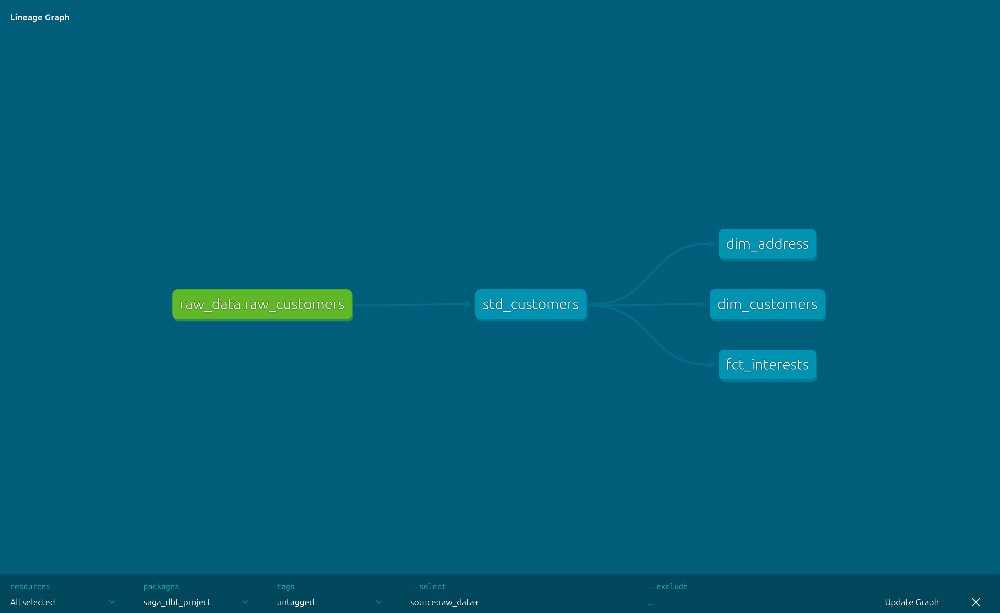
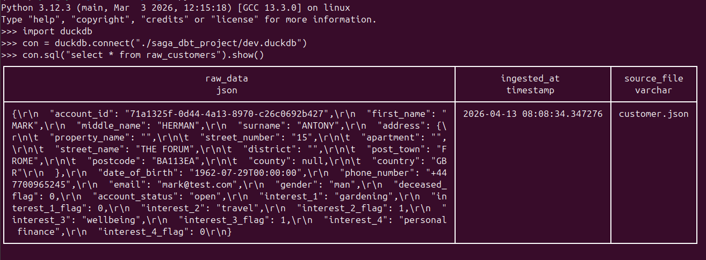

## TASK

### 1. Defining a process to ingest provided json file from file share or folder
At a high-level, a json file has been provided with sample data (with a single record).  The structure of this file is shown in `customer.json.schema`.

To mimic a possible server location for this data (`customer.json`), it has been loaded to a bucket called `saga-test` on Backblaze.  In a possible production environment, such json files may contain any number of records and likely appended with a date (assuming a single file is loaded daily).

A python script, `ingestion.py` is used to download this file and store it in it's raw form in a local DuckDB database.

From here, `dbt-core` is used to transform the data.  In summary, the pipeline is as follows and follows a typical ELT process, (along with a DAG for lineage):

    json file (S3 bucket) --> raw data injestion (Python + DuckDB) --> transformation (DBT on DuckDB)

### 2. File loaded in raw form

json loaded in raw form and can be queried from the `raw_customers` table:

### 3. Define an appropriate target structure with the data

The data has been normalised to provide better flexibility/useability for downstream models and analytics (not shown).  This is broken down into the following 4 models (also see DAG above):

`(saga_dbt_project/models/)std_customers` - a standardised table which simply reads the source data and places it in tabular form, ensuring all columns are of the correct datatype and data tests for uniqueness of PKs and ensuring the "required" columns from the schema are all present.  The data tests can be seen in [schema.yml](saga_dbt_project/models/schema.yml).

`(saga_dbt_project/models/)dim_customers` - dimension model for just the customer data (removed interests and address)

`(saga_dbt_project/models/)dim_address` - dimension model for address

`(saga_dbt_project/models/)fct_interests` - fact table for interests.  Unpivots interests and makes it easier to join on downstream.

## Submission

### 1. DML + DDL

Can be found in following folders: [models](saga_dbt_project/models) and [models](saga_dbt_project/target/run/saga_dbt_project/models) (these have been autogenerated by DBT at runtime)

### 2. Assumptions

- Single address per account
- Max 4 interests per user (if additional interests come through in the json, some minor changes may need to be made to the models)
- Assuming multiple account per address are possible, hence the window function in `dim_address`.

### 3. Omissions and future developments

- The ingestion script is rudimentary.  It does not follow OOP principles, modularity or error handling (type hints would also be good)
- In reality, new datasets would likely be loaded on a daily basis.  Some sort of pub/sub messaging system could be used to trigger the python script for each new file that lands in the bucket.
- Currently, an embedded OLAP DB is being used.  While powerful, it will not be able to handle high volume throughput.  Initial ingestion may be better suited to a postgres DB.  Subsequent transformations can be handled with a dedicated cloud based warehouse.  This is because DuckDB cannot handle multiple/concurrent write (as far as I'm aware) so the DB is locked when the ingestion takes place.  If DBT attempts to create models at the same time, it would cause conflicts.
- Currently, there is no orchestration.  DBT has its own job scheduler, alternatively Github Action can be used or dedicated orchestration tools can be used (Prefect, Airflow, Dagster) to ensure analytics models are updated on a predefined cadence.
- Technically, Backblaze (or any S3 compatible storage) can also be used as the warehouse, utilising Iceberg table formats.  I believe this would be more cost-effective than cloud based warehouses but don't understand enough about this to be certain.

## Setup
1. create virtual env and install requirements
2. ensure .env file is populated with creds
3. navigate to the root of the DBT folder (`saga_dbt_projects`).
4. run the DBT command `dbt build --select +std_customers+`.  This will materialise (in this case, as views) all upstream and downstream models.
5. a preview of the data can be seen by running `dbt show --select dim_customers`
6. to view lineage, run `dbt docs generate` and then run `dbt docs serve` and navigate to `localhoust:8080`